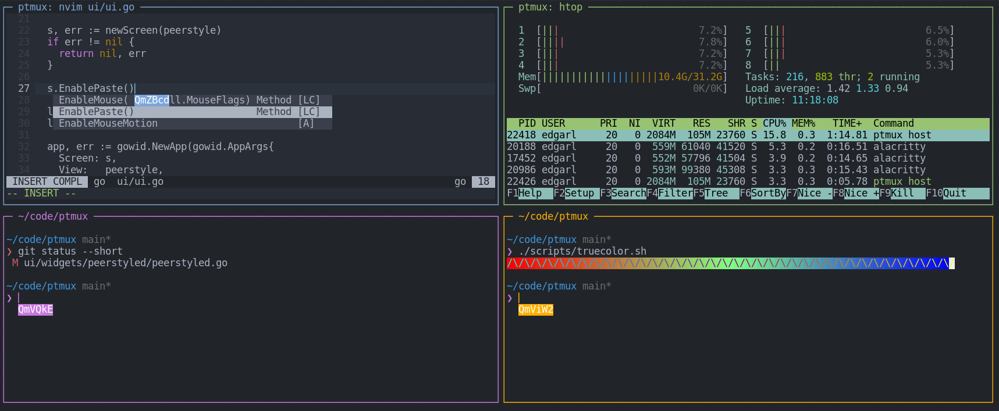

# ptmux
peer to peer terminal multiplexer



## Alpha quality

- No security yet
- Recommend running in container for now

```sh
docker run --rm -it hinshun/ptmux
```

## Installation

```sh
go install github.com/hinshun/ptmux@latest
```

### Key Bindings

| Key(s) | Description
|-------:|:------------
|<kbd>Ctrl+b "</kbd> | Split horizontally
|<kbd>Ctrl+b %</kbd> | Split vertically
|<kbd>Ctrl+b x</kbd> | Kill pane
